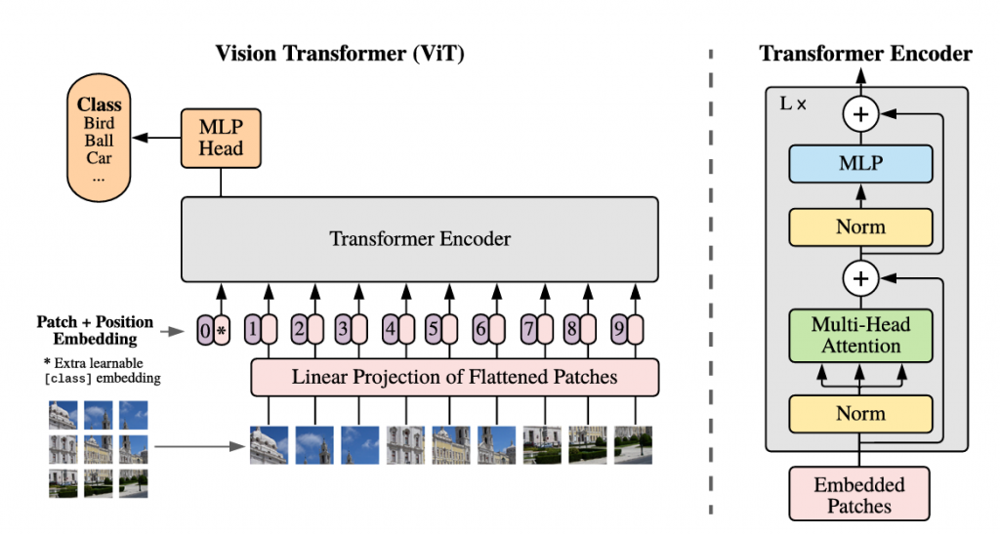

# Vision Transformer in Pytorch

Learn/Refresh about Vision Transformer architecture

## Requirement
- pytorch
- matplotlib
- einops

## Step to run
```
# create environment
python3 -m venv venv
source venv/bin/activate
pip install -r requirements.txt
```
Then run cells in Jupyter notebook

## Reference
[Implementing Vision Transformer (ViT) in PyTorch by Francesco Zuppichini](https://towardsdatascience.com/implementing-visualttransformer-in-pytorch-184f9f16f632)
